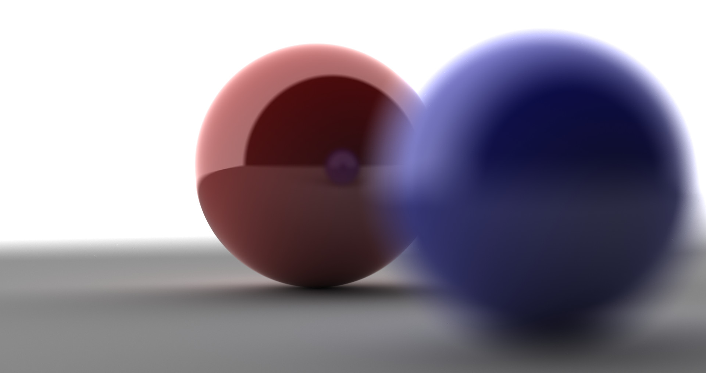

# GLSLPathTracer
Biased Path Tracer based on GLSL to render on screen in realtime.

This program is built using [parrlibgl](https://github.com/AlessandroParrotta/parrlibgl), consider heading there for more info on how to build it.

# User Macros for include/library paths
This project uses some User Macros to facilitate the development of multiple projects at the same time; 
A file called PropertySheet.props that contains the names of these macros (with empty value fields) is included in the root folder of the project; it is responsibility of the user to populate the macros of this PropertySheet in order to be able to include the header and library files within the project (alternatively, it is possible to just edit the Include and Library directories in the GLSLPathTracer's project properties)
